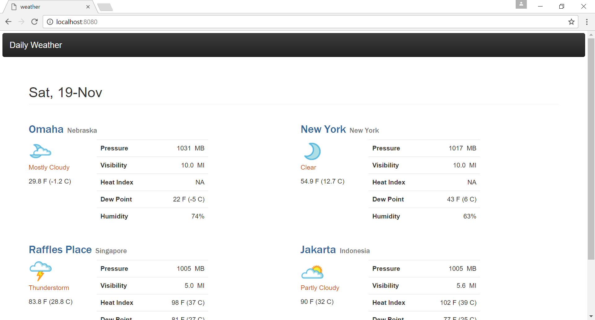
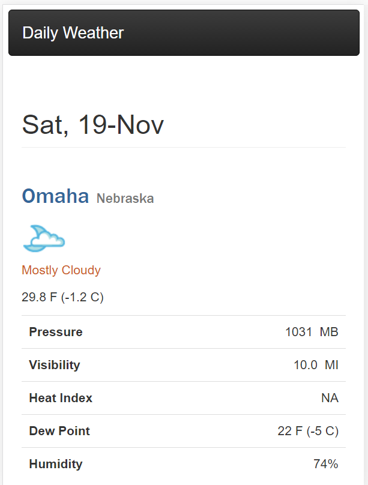
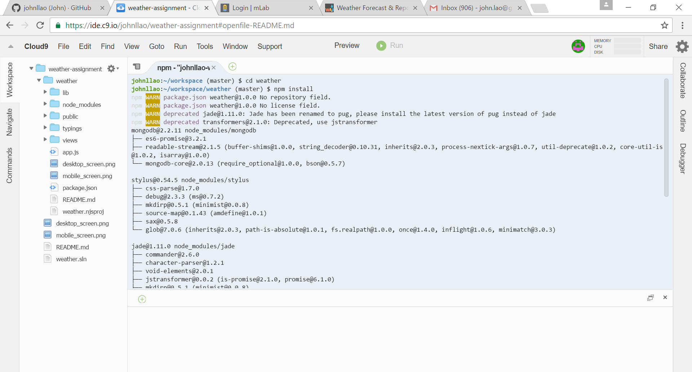
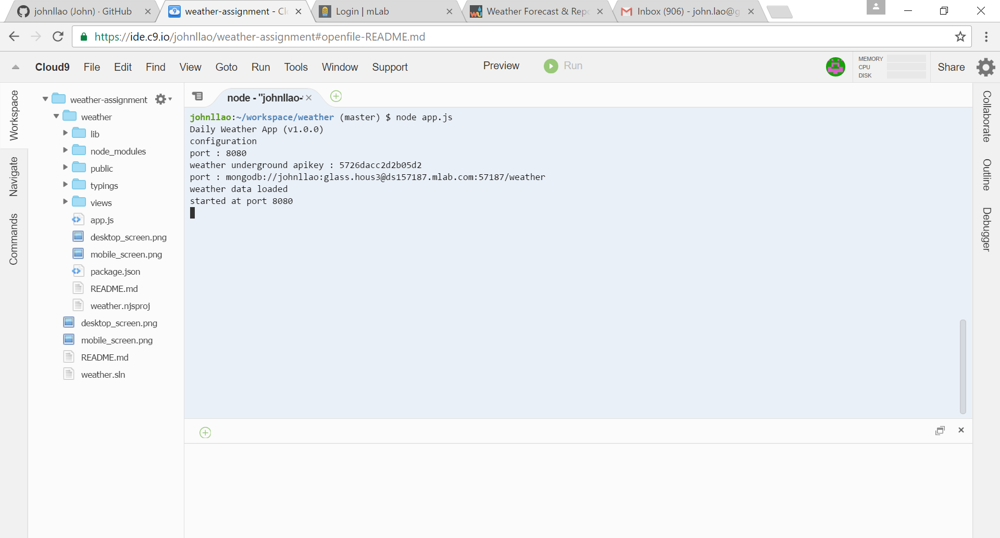

# Daily Weather

A weather app source weather information for cities such as Singapore, Omaha, New York, Jakarta and Saporro Japan. 
The app uses the data provided by the Weather Underground service and displays them.

## Screenshots

**Desktop**


**Mobile**



## Running the Weather App using Cloud9

1. Login to Cloud9 
   ```
   https://c9.io/login
   ```
   
2. Clone GIT Repository (if workspace is not yet created)
   ```
   https://github.com/johnllao/weather-assignment.git 
   ```

3. From the bash window go to 'weather' directory
   ```
   cd weather
   ```
	
4. Run npm install 
   ```
   npm install
   ```
   
   
   
5. Run the application
   ```
   node app.js
   ```
   
   
   
6. Open URL: https://weather-assignment-johnllao.c9users.io:8080


## Design and implementation

On startup the weather app runs a 'setup' routine to populate the list of cities from the configuration 'lib/config.json'. 
The configuration will tell the URL to source the weather data from Weather Underground. The application will retrieve the
weather data from the URL and cached them into MondoDB collection 'weather.locations'. For convenience purpose the MondoDB
collection will be created autamatically upon the 'setup' routine.

Accessing URL `https://weather-assignment-johnllao.c9users.io:8080` from browser will open the app. The App uses Bootstap to 
layout each cities as tiles. For large devices the two cities are aligned each row while for small devices 1 city per row. 

On the upper right, a sort dropdown button to allow the list be sorted according to ID, 'city name', 'temperature' and 
'weather description'.  
